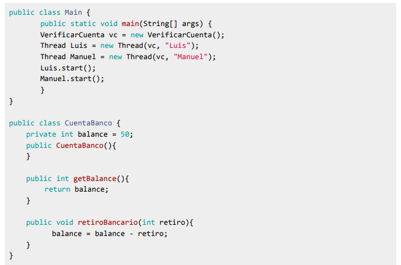
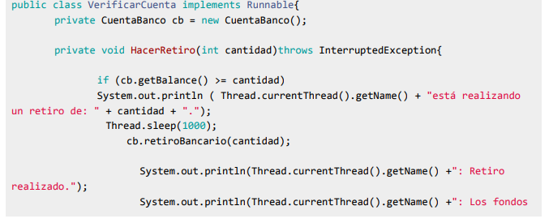
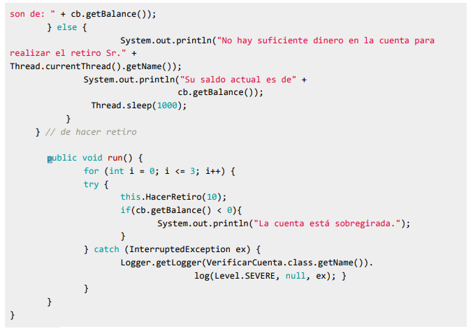

# Trabajo práctico Nº 3

### Sección crítica - Sincronización

1- En este ejemplo vamos a tener 3 clases: una clase Main, una clase CuentaBanco y una clase VerificarCuenta (Hilo).

    a- Ejecute el código y comente el resultado. ¿Qué corrección debería realizar para mejorar la protección de los datos?.

> Sincronizando la realizacion de extraccion el codigo analiza correctamente el saldo en cuenta para poder realizar las extracciones posibles.
